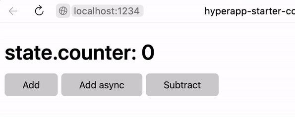

# hyperapp-counter

Example of Hyperapp counter application with TypeScript, JSX and Parcel. Hyperapp starter you can find in [noveogroup-amorgunov/hyperapp-starter](https://github.com/noveogroup-amorgunov/hyperapp-starter).



### Features

- Using TypeScript
- Extending library `h` function to use JSX 
- Bundling with Parcel

### Installation

```bash
npm i
npm start
```
